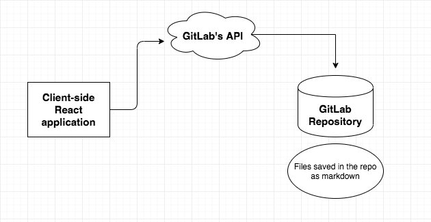

# GitNotes

[GitNotes current deployment](https://gitnotes.skillcamp.io/)

## About

GitNotes is a web-based note taking application, backed by git. The application
will use API's of some of the largest git hosting sites to interact with your
own repository. For a [MVP], we will focus on [GitLab's APIs], but will expand
to GitHub and BitBucket in the future. We plan to use Oauth2 authentication
from these providers, which means we will not store any user data or have a
need for a backend. Files will be stored as `.md` files in the users git
repository, then rendered as html on the client side.



[mvp]: https://en.wikipedia.org/wiki/Minimum_viable_product
[gitlab's apis]: https://docs.gitlab.com/ee/api/

## Getting Started

To build and run the dev environment

```bash
npm install
npm run start
```

To run the tests

```bash
npm test
```

## Making contributions

We openly welcome any and all contributions. If you have comments, questions or
ideas, please don't hesitate. We would love to hear from you. Check out our
[Contributing guide] for tips on how to get started. A great place to get in
touch with us is our [Slack Channel]. If you want to see what we have planned
or what you can do to contribute, check out the [project's issue board].

[contributing guide]: docs/CONTRIBUTING.md
[slack channel]: https://join.slack.com/t/skillcamp-io/shared_invite/enQtMzgxMjM5NjU1OTU4LTIzNDIzZTA3YTY0ZTY1NWVmMDUxZDllZjVmZjNiZDRiZTdhN2RhZjhhZTI5MGQxNzY1ZDlhNTAxYTlmNWRkYzA
[project's issue board]: https://gitlab.com/skillcamp/gitnotes/issues/

## Built With

- [React.js](https://reactjs.org/) - Web Framework
- [Redux](https://redux.js.org/) - Application State Management
- [Styled Components](https://www.styled-components.com/) - Styling

## Authors

A special thank you to everyone has who participated in this project! See the
full list of [contributors].

[contributors]: https://gitlab.com/skillcamp/gitnotes/graphs/master

## License

This project is licensed under the GPLv2 License - see the [LICENSE] file
for details.

[license]: LICENSE
